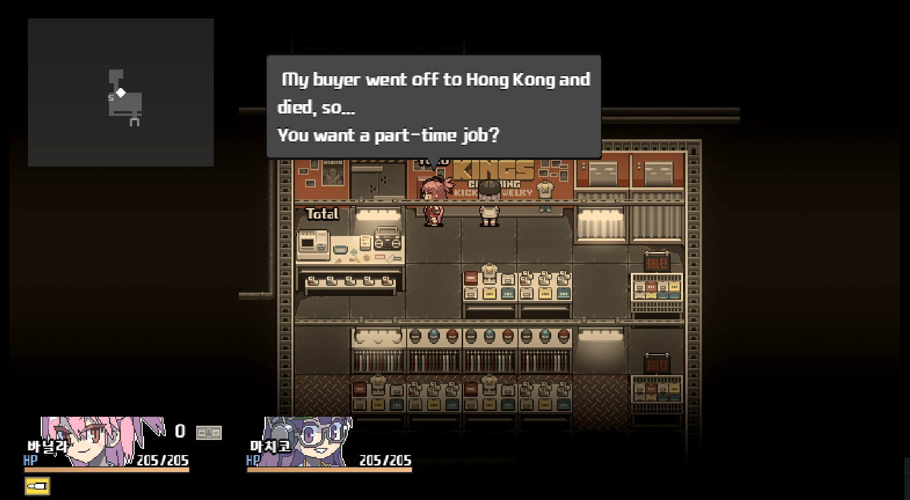
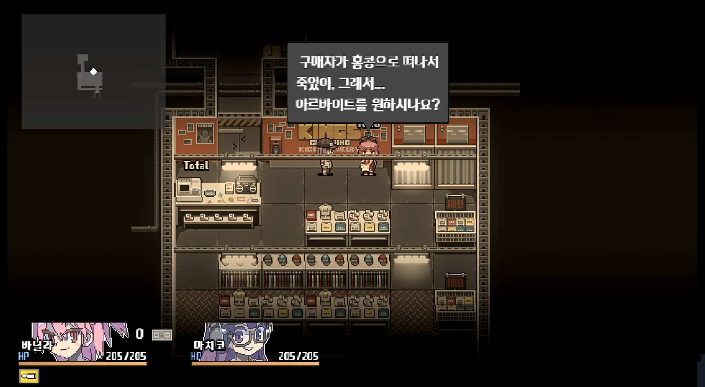

# RPGMaker-MV Translator by DeepL 🕹️

## There is already [RPG-MV translate tool](https://github.com/RPG-Maker-Translator/RPG-Maker-Translator). Why you maked this?

Because [DeepL](https://github.com/DeepLcom/deepl-python) is better than Google Translate for English-Korean translations. That's all.

|**OrangeBlood (EN)**| **DeepL Translation (KO)** |
|:---------------------------------:|:-------------------------------------:|
|    |          |

## How to use this?

You need to get [deepL API key](https://www.deepl.com/ko/account/summary) by yourself.

If you get key, you can use deepL to automatic-translate.

## Game files overview 🎮

Game files containing the data we want to translate are usually contained in the folder `data/`.
Among these json files, the ones we are going to translate are the following:
- `Armors.json`: contains the **name** and the **description** of all armors 🛡️. ️
- `Weapons.json`: contains the **name** and the **description** of all weapons 🗡️.
- `Items.json`: contains the **name** and the **description** of all items 💡.
- `Skills.json`: contains the **name** and the **description** of all skills ⚡.
- `Enemies.json`: contains the **name** of all enemies 👾.
- `MapInfos.json`: contains the **name** of all maps 🗺️.
- `Classes.json`: contains the **name** of all classes 🧙.
- `States.json`: contains the **name** and the relative **messages** of all states ✨.
- `Actors.json`: contains the **profile** of all characters 👩.

Other files that need to be translated, but deserve particular attention are:
- `CommonEvents.json`: contains the **dialogs** relative to the common events in the game 🤖.
- `MapXXX.json`: contains the **dialogs** relative to all the maps. Basically it contains most of the dialogs on the
  game which would probably require a massive amount of time if translated manually 🗺️.

The remaining files are not translated since they don't contain much text to translate such as `System.json` or there is
nothing critical to translate such as `Animations.json`.

## Usage 💡

### Translate the dialogs files

**Note**: the program uses a Google Translate API to perform translations, thus a **stable** internet connection is required.

1. Clone this repo: `git clone https://github.com/lunacat16/rpgmaker-mv-translator-DeepL`.
2. Install dependencies: `pip install -r requirements.txt`.
3. Copy `CommonEvents.json` and all the `MapXXX.json` files from you game `data/folder` to this project `dialogs` folder.
4. For a basic usage, run the command: (! This is different with Original version.)
```
  python dialogs_translator.py --source_lang EN --dest_lang KO --verbose --auth_key [YOUR_API_KEY]
```
3. Most important arguments explanation:
   - `source_lang`: (string) the **original language** of your game (EN - English, KO - Korean, ...). If omitted, deepL will automatically detect the language.
   - `dest_lang`: (string) the language you want to **translate** your game.
   - `verbose`: (bool) if True, show each original and corresponding translated sentence during execution.
   - `input_folder`: (string) the folder containing the files to translate (default: `dialogs`).
   - `print_neatly`: (bool) if True, adapts the translated sentence to fit the dialog window. 
     This is because, by default, each dialog window row is a unique string itself and its length can change after translation.
     This option also improves the translation quality because each dialog window would be translated at once without
     translating each row one by one which causes loss of context. If you are curious how this algorithm works you can
     check this [blog](https://davideliu.com/2019/12/22/print-neatly/).
   - `max_len` (int): Used only when `print_neatly` is True. Indicates the length of the dialog window.
   - `auth_key` (string): Enter your deepL API key.
4. After execution, which may take a while depending on the number and size of files, your translated files will be saved in `data_xx`
   where `xx` is the code of the translated language (`dialogs_en` if `--dest_lang en`).
5. Copy back the content of `dialogs_xx` to the folder `data` of your game replacing the old files.

Example of **print neatly** with `max_len=32` translating from english to italian:
```
   |The hunter has won the battle  |
   |and unlocked a new secret      |
   |skill.                         |
   
   After italian translation without print neatly:
   
   |Il cacciatore ha vinto la batta|glia
   |e sbloccato una nuovo segreto  |
   |potere.                        |
    
    After print neatly:

   |Il cacciatore ha vinto la      |
   |battaglia e sbloccato un nuovo |
   |potere segreto.                |
```

### Translate the object files

1. Copy the files you want to translate among `Armors.json`, `Weapons.json`, `Items.json`, `Skills.json`, `Enemies.json`, `MapInfos.json`, `Classes.json`, `States.json`, `Actors.json`
   from you game `data/` folder to this project `object` folder.
3. For a basic usage, run the command:
```
  python objects_translator.py --source_lang EN --dest_lang KO --verbose --auth_key [YOUR_API_KEY] 
```
3. The arguments are the same as the ones used by `dialogs_translator.py`, and print neatly is automatically used in the **description** field.
    By default `input_folder` is set to `objects`).
4. After execution, your translated files will be saved in `objects_xx`
   where `xx` is the code of the translated language (`objects_en` if `--dest_lang en`).
5. Copy back the content of `objects_xx` to the folder `data` of your game replacing the old files.

## Support
If you found this project interesting please support me by giving it a :star:, I would really appreciate it :grinning:

## More
Check this [link](https://davideliu.com/category/videogames/) to play some of my RPGs 😍. 
